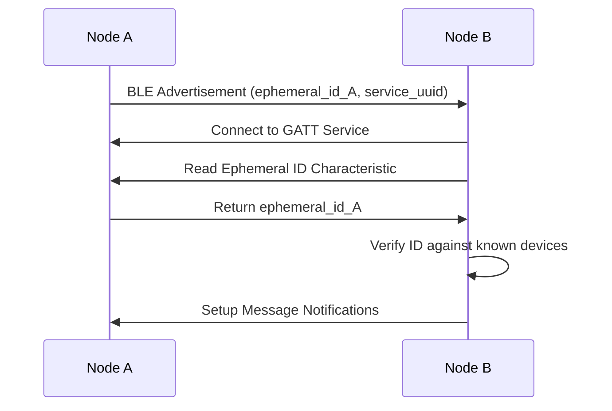
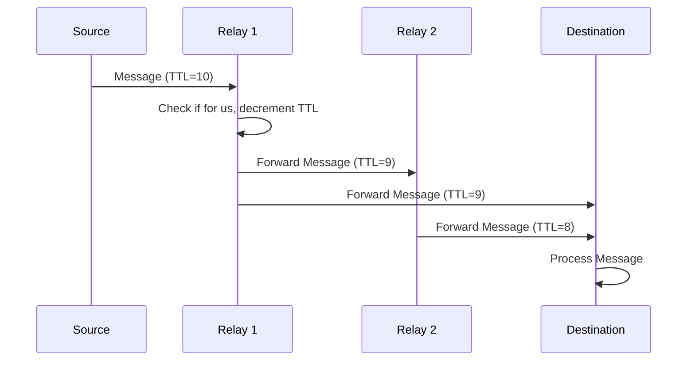

# OffGrid Mesh Architecture

## Overview

The OffGrid Mesh Network is a privacy-preserving Bluetooth Low Energy (BLE) mesh networking system that uses rotating ephemeral identifiers to prevent device tracking while maintaining network connectivity.

## Core Components

### 1. Ephemeral ID Manager (`ephemeral_ids.py`)

The ephemeral ID manager is responsible for:

- **ID Generation**: Uses HKDF (HMAC-based Key Derivation Function) with SHA-256 to derive ephemeral IDs
- **Rotation**: Automatically rotates IDs at configurable intervals (default: 5 minutes)
- **Verification**: Validates ephemeral IDs from other nodes using shared cryptographic material
- **Privacy**: Ensures external observers cannot correlate device activities across time

#### Cryptographic Design

```
ephemeral_id = HKDF(
    key_material = device_id,
    salt = shared_secret, 
    info = "ephemeral_id_v2" || epoch,
    length = 8 bytes
)
```

Where:
- `device_id`: 32-byte unique identifier per device
- `shared_secret`: 32-byte secret shared among all mesh participants  
- `epoch`: Current time divided by rotation interval
- `||` denotes concatenation

### 2. BLE Transport (`ble_transport.py`)

The BLE transport layer handles:

- **Discovery**: BLE scanning for mesh peers using service UUIDs
- **Advertising**: Broadcasting ephemeral IDs and mesh service availability
- **GATT Services**: Custom characteristics for mesh communication
- **Connection Management**: Automatic peer connection and verification

#### GATT Service Structure

```
Service UUID: 6ba7b810-9dad-11d1-80b4-00c04fd430c8
├── Ephemeral ID Characteristic (Read): 6ba7b811-9dad-11d1-80b4-00c04fd430c8
├── Message Characteristic (Write/Notify): 6ba7b812-9dad-11d1-80b4-00c04fd430c8  
└── Status Characteristic (Read): 6ba7b813-9dad-11d1-80b4-00c04fd430c8
```

### 3. Mesh Node (`mesh_node.py`)

The mesh node combines ephemeral ID management with BLE transport to provide:

- **Message Routing**: Multi-hop forwarding with TTL-based loop prevention
- **Peer Management**: Discovery, verification, and connection tracking
- **Message Handling**: Pluggable handlers for different message types
- **Statistics**: Network usage and performance metrics

## Privacy Properties

### Unlinkability

Ephemeral IDs change regularly, preventing correlation of device activities across different time periods. External observers see only random 8-byte identifiers that appear unrelated.

### Forward Privacy

Old ephemeral IDs cannot be derived from current ones or future keys, protecting historical activities even if current keys are compromised.

### Mesh Participant Recognition

Despite rotating IDs, legitimate mesh participants can:
1. Derive expected IDs for known device IDs using the shared secret
2. Verify incoming IDs against their peer database
3. Maintain routing tables using persistent device IDs internally

### Clock Skew Tolerance  

The verification process checks multiple epochs (±2 from current) to handle:
- Network latency in ID propagation
- Clock drift between devices
- Temporary network partitions

## Message Flow

### 1. Peer Discovery



### 2. Message Routing



## Security Considerations

### Threat Model

**Protected Against:**
- Passive tracking by external observers
- Location correlation attacks
- Long-term device profiling

**Not Protected Against:**
- Active attacks with compromised shared secret
- Physical device compromise
- Traffic analysis of encrypted messages

### Key Management

- **Shared Secret**: Must be distributed securely to all participants
- **Device IDs**: Should be generated with cryptographically secure randomness
- **Rotation Timing**: Synchronized using system clocks (NTP recommended)

## Performance Characteristics

### Memory Usage
- Ephemeral ID cache: ~100 bytes per known peer
- Message cache: ~50 bytes per recent message (1 minute window)
- Connection state: ~200 bytes per active connection

### Network Overhead
- Advertisement frequency: Every 30 seconds
- ID rotation: Every 5 minutes (configurable)
- Message overhead: ~100 bytes JSON envelope per message

### Battery Impact
- BLE scanning: Moderate (duty-cycled)
- GATT connections: Low (event-driven)  
- Cryptographic operations: Minimal (HKDF is efficient)

## Configuration Parameters

| Parameter | Default | Description |
|-----------|---------|-------------|
| `rotation_interval` | 300s | How often ephemeral IDs rotate |
| `scan_interval` | 1.0s | BLE scan frequency |
| `id_length` | 8 bytes | Length of ephemeral identifiers |
| `ttl` | 10 hops | Maximum message forwarding hops |

## Future Enhancements

- **Authenticated Encryption**: Add message authentication/encryption
- **Routing Optimization**: Implement more efficient routing protocols
- **Network Partitioning**: Handle split-brain scenarios gracefully
- **Bandwidth Management**: QoS and rate limiting for message types